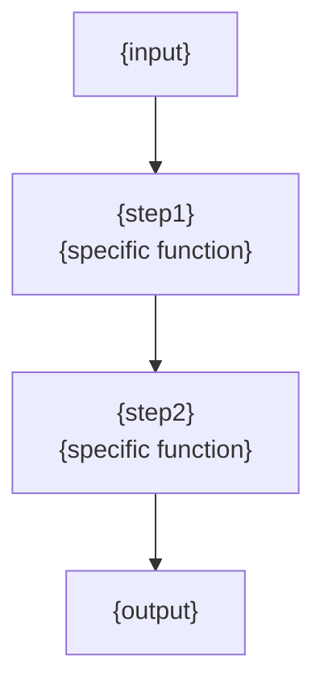

# Stage 2: Research — Detailed Execution Guide

## Research Strategy Overview

Research stage simulates deepwiki-rs's 8 specialized agents with a sequential + parallel execution strategy:

```
C1 System Context -> C2 Domain Modules -> [C2 Architecture + C2 Workflow + C3 Key Modules + C3 Boundary + C3 Database (conditional)]
```

Higher-level research feeds lower-level research with context, ensuring consistent and deep analysis.

---

## Step 2.1: System Context Research (SystemContextResearcher)

### Goal
Collect all information needed for the C4 Context diagram: system boundary, user roles, external dependencies.

### Analysis Checklist

**Users**:
- [ ] Who are the direct users? (developers / end users / other systems)
- [ ] How do different user roles use the system differently?
- [ ] What interface do users use to interact (CLI / Web UI / SDK / API)?

**External systems**:
- [ ] Which external services does the system depend on? (DB / third-party API / message queue / LLM)
- [ ] Is the system called by other systems? (upstream or downstream?)
- [ ] External file system or storage dependencies?

**Business value**:
- [ ] What core business problem does the system solve?
- [ ] Without this system, what would users do manually?
- [ ] What are the main inputs and outputs?

### Search Strategy
```
codebase_search: "external API call" / "HTTP client" / "database connection"
grep_search: "reqwest::" / "axios" / "fetch(" / "http.Get" / "requests.get"
grep_search: "env::" / "dotenv" / "os.Getenv" / "process.env"  # find env vars to infer external deps
```

### Output Format: C1 System Context Report

**Narrative style note**: don't write a flat definition like "{system name} is a {system type}". Use narrative language to explain "why this system is needed, what pain point it solves". User role tables should have interpretive paragraphs before and after.

```markdown
## C1 System Context Report

### System Definition
{System name} is a {system type} for {core function, 1-2 sentences}.

### User Roles
| Role | Description | Main usage scenario |
|------|-------------|---------------------|
| {role1} | {description} | {scenario} |

### External System Dependencies
| External system | Interaction type | Data flow direction | Criticality |
|-----------------|------------------|---------------------|-------------|
| {system1} | API / DB / file | in / out / bidirectional | high / medium / low |

### Business Value
- **Core problem solved**: {description}
- **Main input**: {description}
- **Main output**: {description}

### System Boundary (in scope)
- {capability1}
- {capability2}

### System Boundary (out of scope)
- {explicitly not done1}
- {explicitly not done2}
```

---

## Step 2.2: Domain Modules Detection (DomainModulesDetector)

### Goal
Apply DDD thinking to identify bounded contexts and module boundaries within the system, then build the module relationship graph.

### Analysis Checklist
- [ ] What independent business capability domains exist in the system?
- [ ] What is the core responsibility of each domain?
- [ ] How do domains depend on each other? (who depends on whom)
- [ ] Which are core domains? Supporting? Generic?

### Detection methods
1. **From directory structure**: every subdirectory under `src/` (or equivalent main source dir) is a candidate domain module — no selective omission
2. **From code organization**: `mod.rs` / `index.ts` / `__init__.py` declares the module's public interface
3. **From dependencies**: use `grep_search` to trace `use` / `import` statements and draw the dependency graph
4. **From naming semantics**: names like `cache` / `llm` / `memory` / `research` / `compose` often directly reveal responsibility
5. **DDD semantic grouping**: multiple small directories may belong to the same domain (e.g. `cache/` + `performance_monitor/` -> "caching domain")

### Full coverage rule (critical!)

deepwiki-rs's DomainModulesDetector uses an LLM to detect all domain modules automatically and analyzes each one. The agent must reach the same coverage:

**Step A: enumerate all candidate modules**
```
Scan every first-level subdirectory under src/
-> list the complete directory inventory
-> exclude pure test directories (*_test/, *_spec/) and pure generated directories (*_generated/)
-> every remaining directory = one candidate domain module
```

**Step B: DDD semantic grouping**
```
Group candidates by DDD classification:
- Core domain: directly contributes business value (workflow, research, compose, preprocess)
- Supporting domain: provides technical support to core (llm, integrations, cache)
- Generic domain: generic infrastructure (types, utils, memory, i18n, config)
```

**Step C: sub-module identification**
```
For each domain module:
- List subdirectories and key files within the module
- Extract each submodule's responsibility, core functions, code paths
- Tag importance (1-10) and complexity (1-10)
```

**Step D: inter-domain relationships**
```
Draw module dependency diagram (Mermaid graph)
Identify business flows (cross-domain core data flows)
```

### Search Strategy
```bash
# Find module exports (identify each module's public API)
grep_search: "pub use" / "export { " / "__all__"

# Find inter-module dependencies
grep_search: "use crate::{module_name}" / "from ..{module_name}" / "import * from './{module_name}'"

# Read each module's mod.rs or index.ts
read_file: "src/{module}/mod.rs" or "src/{module}/index.ts"
```

### Output Format: Domain Modules Report (aligns with deepwiki-rs DomainModulesDetector)

```markdown
## Domain Modules Report

### Identified Domain Modules (full list, no omissions)

| Module | Path | Core responsibility | Type (core/supporting/generic) | Importance (1-10) | Complexity (1-10) |
|--------|------|---------------------|-------------------------------|-------------------|-------------------|
| {module1} | `src/xxx/` | {description} | Core | 8 | 7 |
| {module2} | `src/yyy/` | {description} | Supporting | 5 | 4 |
| {all modules...} | | | | | |

### Inter-Domain Relationships
```mermaid
graph TD
  A["core generation<br/>generator"] --> B["preprocess"]
  A --> C["research"]
  A --> D["compose"]
  A --> E["output<br/>outlet"]
  C --> F["LLM integration<br/>llm"]
  D --> F
  {all relationships...}
```

### Business Flows
| Flow | Description | Domains involved | Entry point | Importance |
|------|-------------|------------------|-------------|------------|
| {flow1} | {description} | {domain1, domain2, ...} | {entry function} | {1-10} |

### Per-Module Details (aligns with deepwiki-rs sub_modules structure)

#### {module1 name}
- **Path**: `src/xxx/`
- **Responsibility**: {description}
- **Core abstractions**: {interface/Trait list}
- **Submodules**:
  - {submodule1} (`src/xxx/sub1.rs`): {responsibility}, key functions: {fn1, fn2}
  - {submodule2} (`src/xxx/sub2/`): {responsibility}, key functions: {fn3, fn4}
- **Depends on**: {list}
- **Depended on by**: {list}
- **Importance score**: {1-10}

#### {module2 name}
{Same structure...}

#### ... (cover every identified module)
```

---

## Step 2.3: Architecture Research (ArchitectureResearcher)

### Goal
Identify the overall architecture pattern, core tech choices, and key design decisions.

### Architecture Pattern Signals

**Layered architecture**:
- Directories: `controller` / `service` / `repository` / `model`
- Strict unidirectional dependencies

**Microservices**:
- Multiple independent service directories, each with its own main entry
- Services communicate via HTTP / gRPC / message queue

**Event-driven**:
- `event` / `handler` / `subscriber` / `publisher` naming
- Event bus / message queue integration

**Pipeline-filter**:
- `pipeline` / `stage` / `phase` / `step` / `processor` naming
- Chained processing pattern

**CQRS**:
- Command and query separated code organization
- `Command` / `Query` / `Handler` naming pattern

### Search Strategy
```
codebase_search: "core data flow" / "main processing pipeline" / "core workflow"
grep_search: "Arc<" / "RwLock" / "Mutex" / "Channel" / "async fn"  # concurrency model
grep_search: "impl.*Trait" / "interface.*implements"  # abstraction implementations
```

### Reading Strategy
- Read entry files of all core modules
- Read files clearly taking on "orchestration" responsibility (names contain orchestrator / workflow / pipeline)

### Output Format: Architecture Research Report

**Narrative style note**: don't just write "uses XXX pattern" with a list of evidence numbers. Use narrative language to explain "why this pattern was chosen, what it brings, how it manifests". Design principles should be 2-4 sentences of deep interpretation per principle, not bare declarations. Decision records should say "chose X, rejected Y, because Z" not just "chose X".

```markdown
## Architecture Research Report

### Architecture Pattern
{Narrative interpretation: what this pattern is, why it was chosen, what benefits it brings. Use analogies or metaphors to aid understanding}

Rationale: {evidence from code, written as narrative prose, not numbered list}

### Core Design Principles
{Each principle gets 2-4 sentences of deep interpretation: explain "why this, what problem it solves, how it shows in code". Use analogies.}

1. **{principle1}** — {narrative: what problem it solves, how it shows in code, what benefit}
2. **{principle2}** — {narrative}

### Tech Stack Details
{1-2 sentence narrative before table: explain the tech selection logic}

| Layer / Domain | Tech choice | Why (explain the "why", not just "what") |
|----------------|-------------|------------------------------------------|
| {layer1} | {tech} | {reason} |

### Key Data Structures
{One sentence before table: understanding these types means understanding the data model}

| Type name | File path | Purpose (plain language, not jargon) |
|-----------|-----------|--------------------------------------|
| {type1} | {path} | {purpose} |

### Core Interfaces / Traits / Protocols
{One sentence before table: understanding these abstractions means understanding the design philosophy}

| Name | Implementations count | Core responsibility (plain-language rationale for abstraction) |
|------|----------------------|--------------------------------------------------------------|
| {name1} | {count} | {responsibility} |

### Architecture Decision Records (inferred)
{Each decision says "chose what, rejected what, why" — three columns, not two}

- **Decision 1**: {chose X}, rejected {alternative}, because {reason}
- **Decision 2**: {description}, evidence: {code observation}
```

---

## Step 2.4: Workflow Research (WorkflowResearcher)

### Goal
Identify the system's core business execution flows, understand the complete path from input to output.

### Search Strategy
```
# Find main flow functions (entry points)
grep_search: "pub fn launch" / "fn main" / "async fn run" / "func main" / "def main"

# Find flow coordination (who drives execution order?)
codebase_search: "workflow orchestration" / "flow control" / "phase execution"
grep_search: "workflow" / "orchestrat" / "pipeline" / "sequence"

# Find error handling flow
grep_search: "Result<" / "try {" / "catch {" / ".unwrap_or" / "? "
```

### Reading Strategy
- Focus on the main entry files (`workflow.rs` / `main.rs` / `app.rs` / `server.rs`)
- Trace the call chain of main flow functions (2-3 levels across files)
- Read files responsible for flow scheduling (orchestrator / scheduler)

### Output Format: Workflow Research Report

**Narrative style note**: workflows should not be a flat step 1 -> 2 -> 3 -> 4. First use metaphor or narrative to build overall understanding (e.g. "this pipeline is like a car factory — raw materials arrive -> each workshop processes -> QC leaves the factory"), then expand into detail. Every workflow's "trigger" and "entry" should have narrative explanation of "why this design".

```markdown
## Workflow Research Report

### Main Workflows

{First use metaphor or narrative to build overall understanding, then expand each workflow's detail}

#### Workflow 1: {name}
{Narrative summary: what problem this flow solves, why it matters}
**Trigger**: {user action / event / scheduled}
**Entry**: {function name} in `{file path}`
**Execution steps**:
1. {step1} (call: `{function}`) — {narrative: what this step does, why needed}
2. {step2} (call: `{function}`) — {narrative}
3. ...
**Output / result**: {description}

**Flow chart data**:
- Nodes: [{node1}, {node2}, ...]
- Edges: [{node1}->{node2}, ...]

### Concurrency / Async Model
{Narrative: why the system chose this concurrency strategy ("stability-first over speed-first"), not just describing the tech}

### Error Handling Strategy
{Narrative: the core philosophy of error handling (e.g. "local failure should not cause global interruption"), not just listing techniques}

### Key Sequence Interactions
{Narrative: what key patterns can be read from the sequence diagram (e.g. "every agent goes through a three-step loop: read Memory -> call LLM -> write Memory")}
Participants: [{system1}, {system2}, ...]
Key interactions:
- {system1} -> {system2}: {action} — {narrative}
- {system2} -> {system3}: {action}
```

---

## Step 2.5: Key Module Deep Insights (KeyModulesInsight)

### Goal
Deep analysis of each core domain module, providing material for the `4.Deep-Exploration/` documents.

**Narrative style note**: the module overview in the research report should not be a dry 1-2 sentence "responsibility statement". Use narrative language to explain "what role this module plays in the system, why it's needed, what problem it solves". For example: don't write "Preprocess module handles project preprocessing", write "Preprocess module is the first step of the pipeline. It turns a pile of messy source files into structured information that AI can understand and analyze — the quality of all later research and composition depends heavily on this step's accuracy".

### Per-Module Tiered Analysis (progressive depth control)

| Importance | Depth | Files to read | Mermaid diagrams | Minimum output |
|-----------|-------|---------------|------------------|----------------|
| >=7 (core domain) | Deep | 5+ | Full flowchart + interaction table | Overview + features + components + data flow + interfaces + interactions |
| 4-6 (supporting) | Standard | 3 | Trimmed flow | Overview + features + components + interaction table |
| <=3 (generic) | Brief | 1-2 | None | Overview + core responsibility + file list |

**Core domain examples**: workflow, research, compose, preprocess, llm
**Supporting examples**: cache, integrations, memory
**Generic examples**: types, utils, i18n, config

**Execution rhythm** (analyze and write per module):
```
Core domain module: deep read -> deep analysis -> write_to_file -> release context
Supporting module: standard analysis -> write_to_file -> release context
Generic module: brief description -> write_to_file -> release context
3-4 modules per batch, sorted by importance descending
```

**Parallel search notes**: steps 2.3 (architecture), 2.4 (workflow), 2.6 (boundary) can run searches concurrently. Step 2.5 must run after step 2.2 (domain modules).

**Reading strategy (tiered by importance)**:
1. Module entry file (`mod.rs` / `index.ts` / `__init__.py`)
2. Files with key-name keywords: `core`, `main`, `service`, `handler`, `processor`
3. The largest few files (usually contain core logic)

### Analysis Checklist
- [ ] What is this module's core responsibility (one sentence)?
- [ ] What main public interfaces does the module expose?
- [ ] What is the main internal data flow?
- [ ] Any notable algorithms or design patterns?
- [ ] What are the extension points (pluggable design)?
- [ ] Performance characteristics (sync/async, caching, etc.)?

### Output Format: Module Deep Report (one per module)

**Narrative style note**: module overview should not be a dry "responsibility description in 2-3 sentences". Use plain language to explain the module's reason for existing — "what role it plays in the system, why needed, what problem it solves". For example: don't write "Research module is responsible for multi-agent research analysis", write "The Research module is the pipeline's 'brain' — it's where real deep understanding of the project happens. Preprocessing only breaks the source into fragments; Research's job is to assemble those fragments into a complete picture".

```markdown
## {module name} Deep Report

### What this module does
{Plain language explanation of why this module exists — what role it plays in the system, what problem it solves. 2-3 paragraphs of narrative, not a dry responsibility statement.}

### Core Features
{Each feature should be a narrative description explaining "what problem this feature solves, how it works", not just a name + summary}
1. **{feature1}** — {narrative: what problem this solves, how implemented}
2. **{feature2}** — {narrative}

### Key Components

{One sentence before table: what each component does, why each is needed}

| Component / Type | File path | One-line responsibility |
|------------------|-----------|-------------------------|
| `{Component1}` | `path/to/file` | {plain-language description} |

### Internal Data Flow

{Narrative: how data flows within the module, why designed this way}



Key steps:
1. {step1}: handled by `{function name}` in `src/.../file.rs` — {narrative: purpose of this step}
2. {step2} — {narrative}

### Extension Points
{If pluggable design exists, narratively explain "why extension points exist, how to extend"}

### Performance Considerations
{Narrative: design intent of concurrency, caching — "why designed this way" not just "what technology is used"}
```

---

## Step 2.6: Boundary Interface Analysis (BoundaryAnalyzer)

### Goal
Comprehensively enumerate external interfaces, providing material for `5.Boundary-Interfaces.md`.

### Interface Types and Search Strategy

**CLI interface**:
```
grep_search: "clap" / "argparse" / "cobra.Command" / "click" / "urfave/cli"
grep_search: "#[derive(Parser)]" / "Arg::new(" / "subcommand"
read_file: file containing CLI definition (usually cli.rs / cmd/root.go/cli.py)
```

**REST API**:
```
grep_search: "Router" / "route" / "handler" / ".get(" / ".post(" / "@GetMapping"
codebase_search: "API route definition" / "HTTP endpoint"
```

**Config structure**:
```
grep_search: "#[derive(Deserialize)]" / "interface.*Config" / "dataclass" / "@ConfigurationProperties"
read_file: config struct definition file (config.rs / config.ts / settings.py)
```

**Public library API (if it's a library project)**:
```
grep_search: "pub fn" / "export function" / "public static"  # collect all public functions
read_file: lib.rs / index.ts / __init__.py  # check export list
```

### Output Format: Boundary Interface Report

```markdown
## Boundary Interface Report

### CLI Interface (if applicable)

#### Command: {command name}
- **Description**: {feature description}
- **Arguments**:
  | Argument | Type | Required | Description | Default |
  |----------|------|----------|-------------|---------|
  | {param1} | {type} | yes/no | {description} | {default} |
- **Usage example**:
  ```bash
  {command} {example args}
  ```

### REST API Endpoints (if applicable)
| Method | Path | Description | Request body | Response |
|--------|------|-------------|--------------|----------|
| GET | `/api/xxx` | {description} | - | {format} |

### Config Structure
| Key | Type | Description | Default |
|-----|------|-------------|---------|
| {key} | {type} | {description} | {default} |

### Integration Notes
{How to integrate and use this system}
```

---

## Step 2.7: Database Analysis (DatabaseOverviewAnalyzer) [conditional]

### Trigger conditions
Execute if any of these are detected:
- `.sql` files present
- `migrations/` directory present
- ORM dependency in `Cargo.toml` / `package.json` (diesel / sqlx / prisma / typeorm / sequelize / hibernate)
- `.sqlproj` files present

### Search Strategy
```
list_files: "migrations/" / "sql/" / "db/" / "database/"
grep_search: "CREATE TABLE" / "ALTER TABLE" / "CREATE INDEX"
grep_search: "struct.*Schema" / "entity:" / "@Entity" / "@Table"  # ORM model defs
```

### Reading Strategy
- Read all `.sql` migration files in chronological order to understand schema evolution
- Read ORM entity definition files

### Output Format: Database Overview Report

```markdown
## Database Overview Report

### Statistics
| Type | Count |
|------|-------|
| Tables | X |
| Views | X |
| Stored procedures | X |
| Indexes | X |

### Core Tables
#### {table name}
| Field | Type | Constraint | Description |
|-------|------|------------|-------------|
| {col1} | {type} | PK / FK / NOT NULL | {description} |

### Table Relationships
{Text description of main table relationships, used for ER diagram}
Relationship list:
- {tableA} 1:N {tableB} (via {foreign key field})
- {tableC} N:N {tableD} (via {junction table})
```
