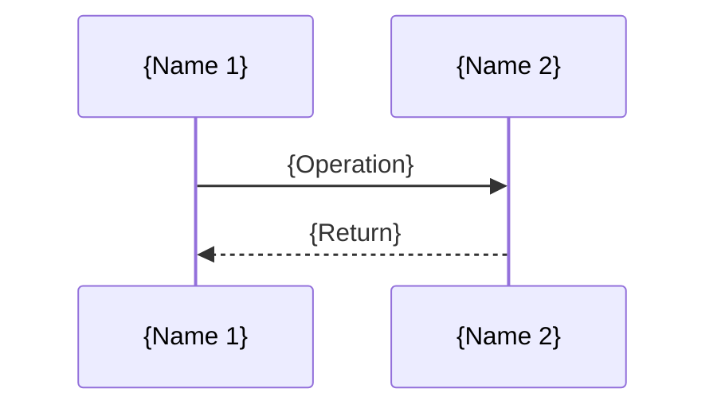
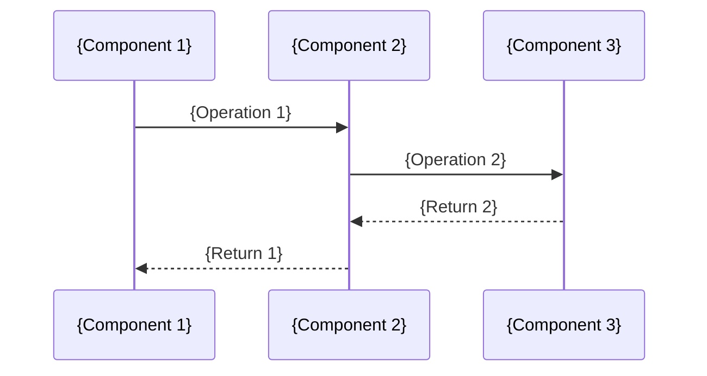
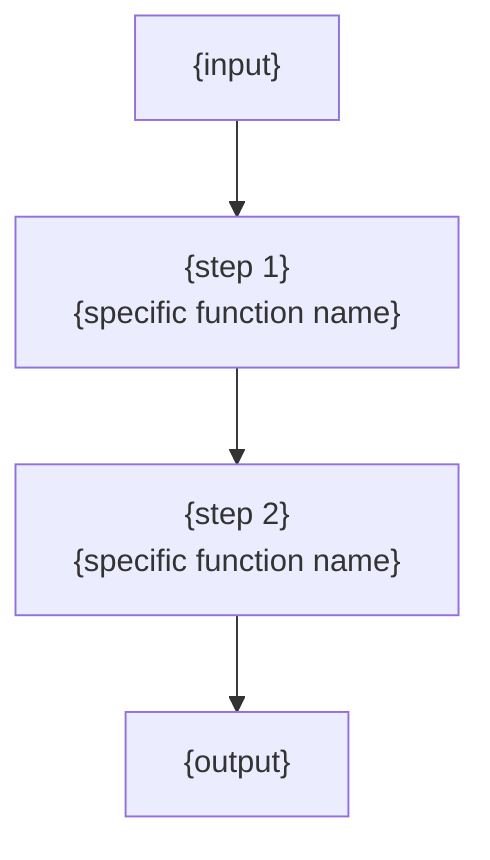

# Stage 3: Document Composition — Detailed Generation Guide

## Setup Reminder

Before any write:

- `{project_root}` is the absolute path to the analyzed repo
- `{output_dir}` is the absolute path chosen in Stage 1 Step 0.2 (default `{project_root}/c4.docs/`)
- `{scratch_dir}` is `{project_root}/.c4-agent/`

**All `write_to_file` calls in this stage use absolute paths under `{output_dir}`.** Relative paths put files in the agent's cwd, not the project — that is the bug that put the 6 docs in the analyzed repo's root.

Every write target in this guide is shown as `{output_dir}/1.Overview.md`, `{output_dir}/4.Deep-Exploration/llm.md`, etc. Substitute the real absolute path before each `write_to_file` call.

---

## Core Principles

1. **Based on research, no guessing**: every description must be backed by code evidence from the stage 2 research reports
2. **Mermaid diagrams must render**: follow syntax rules (see `doc-templates.md`)
3. **Complete structure**: every document must contain its required sections; do not omit core sections
4. **Language consistency**: use the user's specified output language (default: English)
5. **Code reference density**: every module doc must reference at least 3 specific file paths; key component tables must have a file path column on every row
6. **Chunked writes**: large documents split into multiple writes to keep each response bounded
7. **Persist intermediates**: research reports write to `{scratch_dir}` (the `.c4-agent/` dir created in Stage 1 Step 0.3), composition stage reads on demand
8. **Cross-module narrative**: each module doc includes the module's role in core business flows
9. **Narrative writing style**: docs must be human-friendly reading, not cold PPT-style structured text (see detailed guide below)

---

## Narrative Writing Style Guide (P0 critical)

### The problem
Agent-generated docs tend to be "PPT style": section titles lead directly into tables/lists with no context or narrative. To a human reader, this feels like reading slide bullets, not a deep technical article.

### Core requirements

#### 1. Every section opens with a narrative summary
Don't dump a table or list right after a section title. Start with 2-4 sentences explaining "what this section covers, why it matters, what the reader should pay attention to".

**Bad example**:
```
## What it does
- Intelligent code analysis
- C4 model doc generation
- External knowledge enhancement
- AI autonomous reasoning
```

**Good example**:
```
## What it does

The pipeline's core capability can be summarized as a "fully automated pipeline from source code to documentation". Give it a source directory, and it analyzes the code structure, identifies core modules, maps dependencies, then uses a large language model to organize all that into a professional C4 architecture doc set.

**Intelligent code analysis** — the pipeline doesn't just scan filenames. It actually parses code structure. A language-aware parser is tuned to each language's AST...
```

#### 2. Tables must have interpretation prose around them
Never drop an isolated table. Before: explain why this table matters and what to read from it. After: summarize what we can conclude from the data.

**Bad example**:
```
## Tech stack
| Tech | Choice |
|------|--------|
| Rust | language |
| Tokio | async |
```

**Good example**:
```
## Thinking behind the tech choices

The pipeline chose Rust not just to chase "high performance". As an IO-heavy tool that calls external LLM APIs heavily, Rust plus Tokio can efficiently manage concurrent requests and cache reads/writes...

| Tech area | Specific choice | Why |
|-----------|-----------------|-----|
| Language & runtime | Rust (edition 2024) | Memory safety + high performance, with Tokio for dense IO |
| ... | ... | ... |
```

#### 3. Design decisions must say WHY — chosen, rejected, reason
Architecture decisions aren't just "what was chosen". Spell out "what was chosen, what was rejected as alternative, why this choice was made".

**Bad example**:
```
| Decision | Basis |
|----------|-------|
| Memory scope isolation | MemoryScope/ScopedKeys constant |
```

**Good example**:
```
| Decision | Chose | Rejected | Why |
|----------|-------|----------|-----|
| Data passing mechanism | Memory scope isolation | Global HashMap sharing | Prevent stage data stomping on each other; make data flow traceable |
```

#### 4. Use analogies and metaphors to build bridges
Translate technical concepts into everyday analogies to help readers build understanding fast.

**Examples**:
- Memory scope isolation -> "a parcel sorting station with separate zones, each zone only takes its own parcels"
- Unified agent abstraction -> "a standardized workbench, workers just declare 'I need these tools' and the bench prepares them"
- Pipeline -> "an auto production line — raw materials enter -> each workshop processes in turn -> QC leaves the factory"
- CacheManager -> "a money-saver, never re-runs the same inference"
- StepForwardAgent -> "the role description / soul shared by all agents"

#### 5. Module deep-dive docs open with "what this module does"
Don't start with a cold module name and path list. Open with a plain sentence explaining why the module exists.

**Bad example**:
```
# Research Module Deep Exploration

## Core features
1. C1 macro analysis
2. C2 meso analysis
3. C3 micro analysis
```

**Good example**:
```
# Research Module Deep Exploration

## What this module does

The Research module is the pipeline's "brain" — it does the real deep understanding of the project. Preprocessing only breaks source into structured fragments; Research's job is to assemble those fragments into a complete picture...

## The seven agents' division of labor

Research contains 7 specialized agents internally. They handle different analysis dimensions but execute in a fixed layered order:
| Agent | Layer | What it answers |
|-------|-------|-----------------|
| SystemContextResearcher | C1 macro | What problem does this system solve, who does it serve? |
```

#### 6. Workflows open with metaphor, then expand
Don't just list steps 1 -> 2 -> 3 -> 4. First use metaphor to build overall understanding, then expand into per-step detail.

**Example**:
```
The pipeline's workflow can be understood with a simple analogy: it's like a car factory production line — raw materials (source code) enter the factory, get disassembled and sorted in the preprocessing workshop...
```

#### 7. Parameter tables add a "meaning" column
Boundary interface docs shouldn't have just "name / type / default / description" — add a column explaining the **actual meaning and design intent**, not just a tech description.

**Bad example**:
```
| Param | Type | Default | Description |
|-------|------|---------|-------------|
| llm-provider | String | openai | LLM Provider |
```

**Good example**:
```
| Param | Default | Meaning |
|-------|---------|---------|
| llm-provider | openai | Which LLM service to use — different providers have very different API formats and pricing; this param determines your inference capability and cost |
| model-powerful | same as efficient | The model for complex reasoning and graceful degradation — recommend a stronger one than efficient, so there's a powerful fallback when needed |
```

### Writing style self-check (review before every write)

- [ ] Does every section open with a 2-4 sentence narrative summary (not a jump to tables/lists)?
- [ ] Do tables have interpretation prose before and after (not isolated)?
- [ ] Do architecture decisions say "chose what, rejected what, why"?
- [ ] Are analogies / metaphors used to explain key concepts?
- [ ] Do module deep-dive docs open with "what this module does"?
- [ ] Do workflows use metaphor / narrative first to build overall understanding?
- [ ] Do parameter tables have a "meaning" column rather than just tech description?
- [ ] Does the doc read like a "technical article" rather than a "slide outline"?

---

## Intermediate Artifact Persistence Strategy

### The problem
A single agent conversation has a finite context window. As analysis deepens, early research results may be forgotten under context pressure.

### The fix
After each research step, write key findings to `{scratch_dir}` (i.e. `{project_root}/.c4-agent/`):

```
.c4-agent/
├── preprocessing.md        # Stage 1 output
├── c1-system-context.md    # C1 system context
├── c2-domain-modules.md    # C2 domain modules
├── architecture.md         # Architecture research
├── workflow.md             # Workflow research
├── boundary.md             # Boundary interfaces
├── database.md             # Database (conditional)
└── modules/                # Module deep reports (written one at a time)
    ├── llm.md
    ├── cache.md
    └── ...
```

**How the composition stage reads them**:
- When a report is needed -> `read_file` from `{scratch_dir}` using an absolute path
- When not needed -> don't read, save context
- After all output docs are written -> delete `{scratch_dir}` (optional: keep for review)

**Why this works**: equivalent to deepwiki-rs's Memory scope mechanism, but uses the filesystem instead of RAM.

---

## Chunked Write Strategy (P0 critical)

deepwiki-rs generates each document via multiple independent LLM calls. The agent's single-response capacity is bounded, so batch writes are required:

### Large document chunking strategy

| Document | Write strategy | Batching |
|----------|----------------|----------|
| `1.Overview.md` | Single write | Medium doc, usually one shot |
| `2.Architecture.md` | **Chunked** | Write 1: scaffold + design philosophy + pattern table + tech stack -> Write 2: C4 diagrams + module responsibility table -> Write 3: key flow sequence + tech implementation + ADR |
| `3.Workflow.md` | **Chunked** | Write 1: scaffold + core path diagram -> Write 2: main flow diagrams + sequence -> Write 3: concurrency model + error handling |
| `4.Deep-Exploration/*.md` | **One module per write** | Each module is an independent `write_to_file` |
| `5.Boundary-Interfaces.md` | Single write | Usually one shot |
| `6.Database-Overview.md` | Single write | When triggered, single shot |

### How to do chunked writes
- Write 1: `write_to_file` the full scaffold (all section titles + Mermaid diagrams + core tables)
- Write 2+: `replace_in_file` to fill in detail at each `{to-be-filled}` placeholder

---

## Mermaid Diagram Syntax Rules (important!)

### Node ID rules
```
Correct: A, B1, NodeA, myNode
Wrong:   My Node, node-1, @user, node.1
```

### Node label rules (double-quote when special chars present)
```
Correct: A["User (User)"] --> B["System @backend"]
Wrong:   A[User (User)] --> B[System @backend]
```

### Line breaks inside labels
```
Correct: A["first line<br/>second line"]
Wrong:   A["first line
second line"]
```

### Mermaid diagram type guide
| Diagram type | Best for | Keywords |
|--------------|----------|----------|
| `C4Context` | System context (users + external systems) | `Person`, `System`, `Rel` |
| `C4Container` | Container architecture (main subsystems) | `Container`, `Container_Boundary` |
| `C4Component` | Component diagram (inside a module) | `Component`, `Rel` |
| `flowchart TD` | Flow chart (top-down) | `-->`, `-->|label|--> ` |
| `flowchart LR` | Flow chart (left to right) | `-->` |
| `sequenceDiagram` | Sequence diagram (cross-system interaction) | `participant`, `->>`, `-->>` |
| `graph LR` | Dependency graph | `-->` |
| `erDiagram` | Database table relationships | `}|--|{`, `TABLE {` |

---

## Step 3.1: Generate `{output_dir}/1.Overview.md`

**Write target**: `{output_dir}/1.Overview.md` (absolute path). The output dir was chosen in Stage 1 Step 0.2 — if you're about to write to the project root, stop and re-check.

### Document Structure

Note: `{narrative paragraph}` markers below mean **a 2-4 sentence narrative description is required**, not a list or table. Tables must have interpretation prose around them.

```markdown
# {Project Name}

{2-3 paragraph narrative: what this project is, what problem it solves, core capabilities. Don't use lists — use natural language to make clear "why this project is needed"}

## What it does

{Narrative summary: summarize core capabilities in natural language, not lists}

**{capability1 name}** — {narrative: what problem this solves, how}.
**{capability2 name}** — {narrative}.
... (each core capability is bolded, followed by narrative interpretation)

## C4 Context Diagram (system landscape)

{1-2 sentences: what this diagram shows, where this system sits in the wider tooling ecosystem}

```mermaid
graph TB
    {C4 Context or equivalent system context diagram showing user roles, system, external dependencies}
```

{1-2 sentences: what key design decisions can be read from the diagram}

## Thinking behind the tech choices

{Narrative paragraph: why these technologies, not just a list}

| Tech area | Specific choice | Why |
|-----------|-----------------|-----|
| {area1} | {tech} | {rationale, "why" not "what"} |

## What this skill can do, what it can't

{Narrative paragraph: the boundary is important — what's the pipeline's core positioning}

**What it does**: {narrative list, each item in natural language, not keyword piles}
**What it doesn't**: {narrative list, with why}

---

> **Confidence score**: {X}/10 — {narrative: why this score}
```

---

## Step 3.2: Generate `{output_dir}/2.Architecture.md`

**Write target**: `{output_dir}/2.Architecture.md` (absolute path).

**Narrative style note**: architecture is the doc most prone to "PPT-ification". Every design principle must have a narrative interpretation before it. The architecture decision table must have three columns: "chose what / rejected what / why". The Container diagram must have interpretation prose around it.

### Document Structure

```markdown
# System Architecture Document: {Project Name}

**Version:** 1.0
**Category:** Internal architecture doc
**Generated:** {YYYY-MM-DD}

---

## 1. Architecture Overview

### 1.1 Design Philosophy

{2-4 core design principles, each based on identified patterns}

**1. {principle name}**
{How this principle shows in code; reference specific modules or files}

**2. {principle name}**
{description}

### 1.2 Core Architecture Pattern
| Pattern | Implementation | Purpose |
|---------|----------------|---------|
| {pattern1} | {how} | {why} |

### 1.3 Tech Stack Overview
{Detailed tech stack description}

---

## 2. System Context (C4 Level 1)

```mermaid
C4Context
    {Reuse or trim the C4Context from 1.Overview.md}
```

---

## 3. Container View (C4 Level 2)

```mermaid
C4Container
    title Container Architecture - {Project Name}

    Person({userId}, "User")

    System_Boundary({sysName}, "{System Name} Application") {
        Container({containerId}, "{Container Name}", "{Tech}", "{Description}")
        {repeat for each main container/module}
    }

    System_Ext({extId}, "{External System}", "{Description}")

    Rel({src}, {dst}, "{Relationship}")
    {repeat for each relationship}
```

### 3.1 Domain Module Responsibilities
| Module / Domain | Path | Responsibility | Key Abstractions |
|-----------------|------|----------------|------------------|
| {module1} | `src/xxx/` | {description} | {interface / type name} |

---

## 4. Component View (C4 Level 3)

### 4.1 {Core Module 1} Component Architecture

```mermaid
graph LR
    {use graph to describe components within a module}
```

**Component responsibilities:**
{List form, each component's responsibility}

### 4.2 {Core Module 2} Component Architecture
{Repeat}

---

## 5. Key Flows

### 5.1 {Main Workflow}



### 5.2 {Secondary Workflow}
{Repeat}

---

## 6. Technical Implementation

### 6.1 Key Architecture Patterns
{Main design patterns implemented; may include code snippets (pseudocode or actual)}

### 6.2 Concurrency and Parallelism
{How the system handles concurrency}

### 6.3 Performance Optimization
{Caching, batching, lazy loading, etc.}

---

## Appendix: Architecture Decision Records (ADR)

**ADR 1: {title}**
- **Decision**: {what was decided}
- **Why**: {why this decision}
- **Consequences**: {implications}

{Repeat}
```

---

## Step 3.3: Generate `{output_dir}/3.Workflow.md`

**Write target**: `{output_dir}/3.Workflow.md` (absolute path).

**Narrative style note**: workflow doc must open with a metaphor to build overall understanding (e.g. "like a car production line — raw materials enter -> each workshop processes in turn -> QC leaves the factory"), then expand per-step detail. Each workflow opens with a narrative summary explaining "what problem this flow solves, why it matters". Don't just list step 1 -> 2 -> 3 -> 4.

### Document Structure

```markdown
# Core Workflows

## 1. Workflow Overview

### 1.1 System Architecture and Workflow Philosophy
{Brief description of the workflow philosophy}

### 1.2 Core Execution Path

```mermaid
flowchart LR
    subgraph Input Layer
        A[{Input 1}] --> B[{Process}]
    end
    subgraph Process Layer
        C[{Step 1}] --> D[{Step 2}]
    end
    subgraph Output Layer
        E[{Output}]
    end
    Input Layer --> Process Layer --> Output Layer
```

---

## 2. Main Workflows

### 2.1 {Main Workflow Name}

#### Flow Diagram

```mermaid
flowchart TD
    Start([Start]) --> Step1[{Step 1}]
    Step1 --> Decision{Decision condition?}
    Decision -->|Yes| Step2[{Step 2}]
    Decision -->|No| Step3[{Step 3}]
    Step2 --> End([End])
    Step3 --> End
```

#### Sequence Diagram



#### Stage Description
| Stage | Executor | Input | Output | Description |
|-------|----------|-------|--------|-------------|
| {stage1} | {module} | {input} | {output} | {description} |

{Repeat for each main workflow}

---

## 3. Concurrency and Async Model
{How the system handles concurrency}

## 4. Error Handling Strategy
{Error handling and graceful degradation}
```

---

## Step 3.4: Generate `{output_dir}/4.Deep-Exploration/{module_name}.md`

**Write target**: `{output_dir}/4.Deep-Exploration/{module_name}.md` (absolute path). One file per module. Use `mkdir -p {output_dir}/4.Deep-Exploration/` first if needed.

**Narrative style note**: every module deep doc must open with "what this module does" (a plain sentence explaining why it exists), not a cold module name and path list. Component tables must have interpretation prose around them, explaining "what each component does, why each is needed".

### Full Coverage Requirement

The agent must produce a deep doc for **every module** identified in the domain modules report. This matches deepwiki-rs's KeyModulesInsightEditor, which calls an LLM once per domain_module in parallel.

**Execution strategy**:
- Analyze and write per module (immediately `write_to_file` when each is done)
- 3-4 modules per batch, avoid context overflow
- Continue batch by batch until every module is covered

### Code Reference Density (P1)

Every module deep doc must meet:
- **At least 3 specific file path references** (e.g. `src/llm/client/mod.rs`)
- **Key component tables: a file path column on every row**
- **At least 2 specific type / function / Trait names referenced** (e.g. `LLMClient`, `AgentBuilder`, `extract()`)
- Mermaid diagram node labels should include concrete names (e.g. `"LLMClient<br/>unified interface"`), not just `"LLM module"`

### Document Structure (one per core module)

```markdown
# {Module Name} Domain

**Module path**: `src/{module_path}/`
**Generated**: {YYYY-MM-DD}
**Confidence**: {X}/10

---

## Overview

{Responsibility description, 2-3 paragraphs, concrete, based on code analysis not guess}

---

## Core Features

1. **{feature1}**: {description, reference specific functions / types}
2. **{feature2}**: {description, reference specific functions / types}
...

---

## Key Components

| Component / Type | File path | Core responsibility |
|------------------|-----------|---------------------|
| `{Component1}` | `src/.../file.rs` | {description} |
| `{Component2}` | `src/.../another_file.rs` | {description} |

---

## Internal Data Flow



**Key step explanations**:
1. {step 1}: handled by `{function name}` in `src/.../file.rs`
2. {step 2}: handled by `{function name}` in `src/.../another_file.rs`

---

## Key Interfaces and Extension Points

{If the module has pluggable design, describe interface definition and extension mechanism; reference specific Trait / interface names}

---

## Interaction with Other Modules

| Interacting module | Direction | Interface / Protocol | Description |
|--------------------|-----------|----------------------|-------------|
| {moduleA} | depends on | `{specific interface}` | {description} |
| {moduleB} | depended on by | `{specific interface}` | {description} |

---

## Cross-Module Collaboration Scenarios

> This module's role in core business flows (reference business_flows in the domain modules report)

**In {flow1}**: This module is responsible for {role description}. Specific participation:
- {step X}: call `{function name}` to collaborate with {moduleY} to {operation}
- {step Z}: receive {moduleW}'s input `{type name}`, execute {processing}

**In {flow2}**: This module acts as {role} providing {capability description}.

---

## Performance Considerations

{Concurrency, caching, resource management}

---

## Implementation Highlights

{Notable design decisions, algorithms, or code implementation tricks}

---

**Confidence explanation**: {X}/10 — {why, e.g. "based on deep analysis of 3 core files, but auxiliary modules only at survey-level coverage"}
```

---

## Step 3.5: Generate `{output_dir}/5.Boundary-Interfaces.md`

**Write target**: `{output_dir}/5.Boundary-Interfaces.md` (absolute path).

**Narrative style note**: boundary interface doc shouldn't just be parameter tables. Every parameter table should add a "meaning" column (explaining the actual meaning and design intent, not tech description). Config explanations should have context (why this config exists, what happens if you tune it). Open with 1-2 sentences explaining "this section covers the system's external interfaces, including CLI, config, env vars, etc".

### Document Structure

```markdown
# System Boundary Interface Document

This document describes the system's external invocation interfaces, including CLI commands, API endpoints, config parameters, and other boundary mechanisms.

---

{Repeat the structure below for each interface type}

## {Interface type, e.g. "Command Line Interface (CLI)"}

### {Command / interface name}

**Description**: {feature description}

**Arguments**:
| Param | Type | Required | Default | Description |
|-------|------|----------|---------|-------------|
| {param} | {type} | yes/no | {default} | {description} |

**Usage example**:
```bash
{example command}
```

---

## Config Structure

{If the system has config files, describe the config structure}

**Example config**:
```toml/yaml/json
{example config}
```

---

## Integration Notes

{How to integrate this system into other systems or CI/CD pipelines}
```

---

## Step 3.6: Generate `{output_dir}/6.Database-Overview.md` (conditional)

**Write target**: `{output_dir}/6.Database-Overview.md` (absolute path).

**Narrative style note**: even when the project has no database, don't just write a cold declaration. Use narrative language to explain "why this project doesn't need a database, how it solves its persistence needs" — that's more useful than saying "no database". When there is a database, the statistics table must have interpretation prose around it.

### Document Structure

```markdown
# Database Overview

---

## Statistics
| Type | Count |
|------|-------|
| Tables | X |
| Views | X |
| Stored procedures | X |

---

## Entity Relationship Diagram

```mermaid
erDiagram
    {TABLE_A} {
        int id PK
        string name
        int b_id FK
    }
    {TABLE_B} {
        int id PK
        string title
    }
    {TABLE_A} }|--|| {TABLE_B} : "belongs_to"
```

---

## Core Tables

### {Table name}
| Field | Type | Constraint | Description |
|-------|------|------------|-------------|
| {col} | {type} | PK / FK / NN | {description} |

---

## Views, Stored Procedures, Functions

{If applicable, describe each}
```
