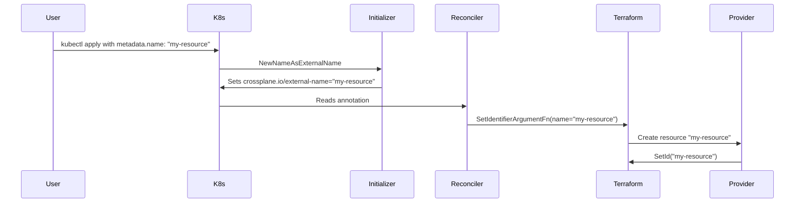

# External name patterns

Every upjet resource needs an external name config. The Terraform ID format
from the import section determines which pattern to use. To confirm the
pattern, check the TF provider source's `d.SetId()` call — it tells you
exactly what format the ID takes at runtime.


## Verifying the ID format

The Terraform import section tells you the shape of the ID, but the exact
format lives in the TF provider source. Verify by reading the Create
function:

1. **Find the TF provider source** on GitHub at the version matching your
   `TERRAFORM_PROVIDER_VERSION`. Read the resource's `.go` file under
   `pkg/resources/` (SDKv2) or the framework equivalent.

2. **Find `d.SetId()` in the Create function** — this call sets the TF state
   ID. Whatever string it receives is the external name format at runtime.

3. **Trace helper functions**: Many providers use encoding helpers that
   transform identifiers before joining them:
   - A simple join encoder concatenates parts with a separator (e.g. `|`),
     each part bare — `part1|part2|part3`.
   - A quoting encoder wraps parts in delimiters (e.g. SQL-style double
     quotes) before joining — `"part1"|"part2"|"part3"`.
   - Some encoders use generics or type parameters: passing a raw string
     treats every part as-is; passing a structured identifier calls its
     `.String()` or `.FullyQualifiedName()` method for quoting.
   - Legacy encoders may omit quoting entirely. When a provider has both
     a legacy and a newer encoder, prefer the newer one — consistent quoting
     prevents false drifts on reconcile.

4. **Check the import function**: The `Importer.StateContext` typically calls
   `ParseResourceIdentifier(d.Id())` to split the ID on the separator. The
   number of parts tells you the compound structure.

5. **Verify string literals against the SDK, not prose.** Object-type tokens,
   separators, and quoting come from the provider SDK's actual constants and
   encoder functions — not from the Terraform Registry's import section
   comment or a scraped `provider-metadata.yaml`, both of which are
   human-written and can be wrong (e.g. a doc comment saying
   `DATABASE_ROLE` when the SDK constant is `sdk.ObjectTypeDatabaseRole =
   "DATABASE ROLE"` with a space). A provider may also mix encoders across
   resources — one legacy (`EncodeSnowflakeID`-style, plain `strings.Join`,
   no quoting added) and one current (`EncodeResourceIdentifier`-style,
   calls `.FullyQualifiedName()` per part, which quotes every dot-segment
   regardless of whether the input arrived quoted or bare). Trace the
   specific resource's actual encoder call, don't assume based on a sibling
   resource in the same provider.

6. **Confirm the pattern** against the decision tree below.

## Decision tree

```go
// Decision logic for Upjet External Name Configuration
// Read the Terraform import section, then trace d.SetId() in the Create function.

IF (provider generates the ID — ARN, URL, UUID, hash)
    USE config.IdentifierFromProvider

ELSE IF (compound ID with separator — pipe, colon, slash)
    IF (a candidate identity field has many:1 cardinality —
        TF's own examples for_each over ANOTHER field while holding this
        one fixed, e.g. one role granted to many parents/users)
        USE §4.6 config.NewExternalNameFrom(config.IdentifierFromProvider,
            config.WithGetIDFn(...)) — build the ID in Go, omit no field
    ELSE IF (exactly one of several mutually-exclusive params fills the
             other segment(s), and cardinality is 1:1 — see §4.5)
        USE §4.5 OneOfIdentifier / config.TemplatedStringAsIdentifier("name", "template")
    ELSE
        USE config.TemplatedStringAsIdentifier("name", "template")
    END IF
    // Azure-style: name is one segment of full resource ID
    // → config.NameAsIdentifier + GetExternalNameFn(extract name from ID) + GetIDFn(reconstruct full ID from name)

ELSE IF (bare name IS the identifier)
    USE config.NameAsIdentifier
    // name omitted from spec via OmittedFields, set via metadata.name

    IF (TF argument is NOT called "name")
        IF (TF argument is a visible spec field — e.g. "bucket" for S3)
            USE config.ParameterAsIdentifier("field_name")
            // Field stays in spec.forProvider
        ELSE
            // TF argument diverges from both "name" and a spec-visible field
            USE config.NameAsIdentifier + custom SetIdentifierArgumentFn + OmittedFields
            // metadata.name drives the ID, mapped to the non-standard TF argument name
        END IF
    END IF

ELSE IF (no import section)
    // The import section is absent, but d.SetId() in the Create function still
    // tells you the format. Read the TF source — the ID is determinable from code.
    IF (d.SetId() receives a provider-generated value — ARN, UUID, URL)
        USE config.IdentifierFromProvider
    ELSE IF (d.SetId() receives a compound of user-supplied parameters)
        // same cardinality check as above: many:1 → §4.6 Go-built ID;
        // else → TemplatedStringAsIdentifier / OneOfIdentifier
        USE config.TemplatedStringAsIdentifier("name", "template")
        // e.g. EncodeResourceIdentifier(user.FQN(), policy.FQN())
        // → TemplatedStringAsIdentifier with the FQN passed through as parameter
    END IF
```

Verify by tracing `d.SetId()` in the TF provider's Create function — whatever string it receives is the external name format.


## Patterns

### 1. IdentifierFromProvider — provider generates the ID

The provider assigns the ID (ARN, URL, UUID, random hash). The user's chosen
name is just a parameter in `spec.forProvider`, not the identifier.

**Config:** `config.IdentifierFromProvider`

**Runtime:** The external name is the provider-generated ID. `DisableNameInitializer: true` — `metadata.name` is just the K8s resource name.

**AWS examples:** `aws_sqs_queue`, `aws_vpc`, `aws_db_instance`, `aws_lb`, `aws_cloudfront_distribution`, `aws_acm_certificate` (hundreds of resources)

```yaml
kind: Queue
metadata:
  name: example          # just the K8s resource name
spec:
  forProvider:
    name: upbound-sqs    # the queue name (not the ID)
```

**How to verify:** The Terraform import section shows a URL, ARN, or UUID.
The provider source calls `d.SetId()` with a compound string (e.g. a URL).

---

### 2. NameAsIdentifier — user name IS the ID

The user chooses the name and it IS the identifier. No extra layer (ARN,
URL, UUID) from the provider.

**Config:** `config.NameAsIdentifier`

**Runtime:** `name` is omitted from `spec.forProvider` (in `OmittedFields`).
The `NewNameAsExternalName` initializer copies `metadata.name` to the
`crossplane.io/external-name` annotation. The framework reads the annotation
and passes it to `SetIdentifierArgumentFn`, which sets `name = externalName`
in the Terraform config.



**AWS examples:** `aws_elasticache_serverless_cache`, `aws_opensearchserverless_access_policy`, `aws_opensearchserverless_lifecycle_policy`, `aws_opensearchserverless_security_policy`, `aws_codeguruprofiler_profiling_group`

```yaml
kind: ServerlessCache
metadata:
  name: example-cache    # THIS is the cache name (no spec.forProvider.name)
spec:
  forProvider:
    engine: memcached
```

**⚠️ Warnings:**

- **Don't change `crossplane.io/external-name` on an existing resource.** The
  annotation is the identity key in Terraform state. Changing it tells upjet
  to abandon the old resource and adopt a new name that doesn't exist yet,
  causing an import failure loop that trips the Crossplane circuit breaker.
  Set it at creation (or let the initializer set it) and never touch it again.

- **Generated examples may be empty.** Upjet only uses
  `MetaResource.Examples[0]` from the scraped metadata. If the Terraform
  doc's first example is minimal (only sets `name`), the generated example
  will show `forProvider: {}` for `NameAsIdentifier` resources because
  `name` is in `OmittedFields`. The example is technically correct — the
  name comes from `metadata.name` — but it's not a helpful starting point.
  Stage a richer example manually.

**How to verify:** The Terraform import section shows a bare name. The
provider source calls `d.SetId()` with a bare name (no ARN, no URL, no
quoting).

---

### 3. ParameterAsIdentifier — a spec field IS the ID

A specific field in `spec.forProvider` doubles as the identifier. The field
stays visible in the spec and is NOT omitted.

**Config:** `config.ParameterAsIdentifier("field_name")`

**Runtime:** `DisableNameInitializer: true`. The external name is the value
of the specified field. The field remains in `spec.forProvider` and can be
changed to recreate the resource.

**AWS examples:** `aws_s3_bucket` (field `bucket`), `aws_lambda_function`
(field `function_name`), `aws_redshift_cluster` (field `cluster_identifier`),
`aws_transcribe_vocabulary` (field `vocabulary_name`)

```yaml
kind: Bucket
metadata:
  name: example          # just the K8s resource name
spec:
  forProvider:
    bucket: my-bucket    # THIS is the bucket name and the identifier
    region: us-west-1
```

**How to verify:** The Terraform import section shows a bare field value.
The provider source calls `d.SetId()` with the value of that specific field.

---

### 4. TemplatedStringAsIdentifier / FormattedIdentifierFromProvider — compound IDs

The external name is built from multiple fields using a template with a
separator.

**Config:** `config.TemplatedStringAsIdentifier("name", "template")` or
`FormattedIdentifierFromProvider("separator", "field1", "field2", ...)`

**Runtime:** The template is evaluated at import time. `{{ .external_name }}`
is the Crossplane external-name annotation value. `{{ .parameters.<field> }}`
reads from `spec.forProvider`. `{{ .setup.client_metadata.account_id }}`
reads from provider metadata.

**AWS examples:** `aws_accessanalyzer_archive_rule` (template
`analyzer_name/rule_name`), `aws_s3_bucket_metric` (separator `:`,
fields `bucket` and `name`), `aws_rds_cluster_role_association` (separator `,`,
fields `db_cluster_identifier` and `role_arn`)

```go
config.TemplatedStringAsIdentifier(
    "rule_name",
    "{{ .parameters.analyzer_name }}/{{ .external_name }}",
)
```

Available template variables:

- `{{ .parameters.<field> }}` — any Terraform argument
- `{{ .external_name }}` — the Crossplane external-name annotation value
- `{{ .terraformProviderConfig.<field> }}` — provider config values
- `{{ .setup.client_metadata.account_id }}` — provider client metadata

**How to verify:** The Terraform import section shows a compound format
(e.g. `field1|field2`, `field1/field2`, `field1:field2`). Check the provider
source for `ParseResourceIdentifier` or equivalent splitting logic.

Edge case — quoted compound IDs: the key distinction is whether quoting is
**uniform** (all segments get the same treatment) or **mixed** (some quoted,
some bare).

- **Uniform quoting** (e.g. `"USER"|"TOKEN"`, `name1:name2`): both segments
  are quoted or both bare. `TemplatedStringAsIdentifier` works cleanly; add
  the quotes to the template:
  `"\"{{ .parameters.user }}\"|\"{{ .external_name }}\""`. The reverse
  extraction (`GetExternalNameFromTemplated`) handles literal double-quotes
  as delimiters.

- **Mixed quoting** (e.g. `"user"|"db"."schema"."policy"` — first segment
  SQL-quoted, second is a multi-segment FQN with its own quoting):
  `TemplatedStringAsIdentifier` still works IF the second segment arrives as
  a single parameter value (the FQN already including its own quoting).
  Pass it through directly — the template doesn't need to understand or
  reproduce the FQN's internal structure:
  `"\"{{ .external_name }}\"|{{ .parameters.policy_name }}"`.
  Only fall back to `IdentifierFromProvider` when the template would need to
  reconstruct the internal quoting of a parameter from multiple sub-fields.

Check the TF provider's `Parse*Identifier` function to understand how it
splits and normalizes the ID. If the provider removes quotes internally,
`NameAsIdentifier` may also be a safe simplification.

### 4.5. Conditional compound IDs — one-of-many mutually-exclusive parameters

Some resources build their ID from the external name plus exactly one of
several mutually-exclusive parameters (e.g. a grant resource where the
grantee is a role, user, database_role, or share — only one is set at a
time). The TF schema marks these with `ExactlyOneOf`.

**Cardinality check — do this first.** `OneOfIdentifier` is a
`TemplatedStringAsIdentifier` under the hood, so `nameField` gets
`OmittedFields` and is driven by `metadata.name` →
`crossplane.io/external-name` (see [Identity cardinality](glossary.md)).
That's only safe when `nameField` has 1:1 cardinality with the resource.
Check the TF resource's own examples: if they `for_each` over the
*conditional grantee* while holding `nameField` fixed (e.g. granting one
role to N different parents/users as separate resources), `nameField` has
many:1 cardinality and `OneOfIdentifier` is the wrong tool — two sibling
grants need two K8s objects, but both want the same
`crossplane.io/external-name` value, which only one object can hold via
`metadata.name` without manually overriding the annotation on every extra
one. Use [§4.6](#46-many-per-parent-compound-ids--no-field-is-the-sole-identity)
instead when cardinality is many:1.

**Config:** provider-local `OneOfIdentifier` helper, for the 1:1-cardinality
case only. Define once in `config/external_name.go`, then use for every
resource with this pattern.

The helper takes a prefix template and a map of parameter → prefix labels,
then builds a `TemplatedStringAsIdentifier` with a sorted-key conditional
chain (`if / else if / end`, no bare else fallback — safe because the
parameters are ExactlyOneOf).

```go
func OneOfIdentifier(nameField, prefix string, params map[string]string) config.ExternalName {
    keys := slices.Sorted(maps.Keys(params))
    var tmpl strings.Builder
    tmpl.WriteString(prefix)
    for i, k := range keys {
        if i == 0 {
            fmt.Fprintf(&tmpl, `{{ if .parameters.%s }}%s|"{{ .parameters.%s }}"`, k, params[k], k)
        } else {
            fmt.Fprintf(&tmpl, `{{ else if .parameters.%s }}%s|"{{ .parameters.%s }}"`, k, params[k], k)
        }
    }
    tmpl.WriteString(`{{ end }}`)
    return config.TemplatedStringAsIdentifier(nameField, tmpl.String())
}
```

**Usage (shape only, hypothetical placeholder — verify both cardinality
per the check above AND every object-type literal against the TF SDK's own
constants before using a real resource here; see step 5 under
[Verifying the ID format](#verifying-the-id-format)):**
```go
"tf_resource_with_one_grantee_per_identity": OneOfIdentifier("identity_field",
    `"{{ .external_name }}"|`,
    map[string]string{
        "grantee_a": "TYPE_A",
        "grantee_b": "TYPE_B",
    },
),
```

> `snowflake_grant_privileges_to_share` was migrated from `OneOfIdentifier`
> to the §4.6 pattern with `GrantPrivilegesToShareIdentifier()` — same
> many:1 cardinality fix as the cautionary tale below. `to_share` stays in
> `spec.forProvider`, allowing multiple grants under one share.

**Cautionary tale:** `snowflake_grant_account_role`,
`snowflake_grant_application_role`, and `snowflake_grant_database_role` were
originally modeled this way with `role_name`/`application_role_name`/
`database_role_name` as `nameField`. Manual testing showed this was wrong —
those TF resources are used with `for_each` over the grantee (granting one
role to many parents/users), a many:1 cardinality — and they were migrated
to the §4.6 pattern. The migration also caught a doc-vs-SDK mismatch: this
section previously showed `DATABASE_ROLE` (underscore) for
`grant_database_role`'s object-type literal; the actual
`sdk.ObjectTypeDatabaseRole` constant is `"DATABASE ROLE"` (space).

When the prefix needs a fixed parameter inline (e.g. `privileges` before the
conditional chain), include it in the prefix template string.

**Why a helper:** Without it, `TemplatedStringAsIdentifier` with 6-9
conditional branches produces unreadable 400+ char inline template strings.
The helper compresses the same logic into ~10 readable lines.

**How to verify:** Check the TF source for `ExactlyOneOf` constraints on the
parameters, AND confirm cardinality per the check above — `ExactlyOneOf`
alone doesn't imply 1:1 identity.

### 4.6. Many-per-parent compound IDs — no field is the sole identity

When cardinality is many:1 (§4.5's check fails), no single field is safe as
`nameField`. Instead, keep every field — including the one that would have
been `nameField` — as a regular, visible `spec.forProvider` parameter, and
reconstruct the ID from all of them in Go via a custom `GetIDFn` on top of
`IdentifierFromProvider`. `DisableNameInitializer: true` (inherited from
`IdentifierFromProvider`) decouples `metadata.name` from the identity
entirely — it becomes a free-form K8s name, and each sibling grant is just
another K8s object.

**Config:** `config.NewExternalNameFrom(config.IdentifierFromProvider,
config.WithGetIDFn(...))` — the same primitive [pattern 6](#6-variable-structure-compound-ids---id-format-depends-on-block-variant)
uses for variable-length IDs. The two patterns solve different problems
(structure varies vs. cardinality is many:1) but share the same mechanism.

**Example (Snowflake `grant_account_role`, fixed from the §4.5 cautionary
tale):**
```go
func buildGrantAccountRoleID(parameters map[string]any) (string, error) {
    roleName, _ := parameters["role_name"].(string)
    if roleName == "" {
        return "", fmt.Errorf("grant_account_role: role_name is required")
    }
    var objectType, target string
    if v, _ := parameters["parent_role_name"].(string); v != "" {
        objectType, target = "ROLE", v
    } else if v, _ := parameters["user_name"].(string); v != "" {
        objectType, target = "USER", v
    } else {
        return "", fmt.Errorf("grant_account_role: neither parent_role_name nor user_name is set")
    }
    return strings.Join([]string{normalizeSFObjectID(roleName), objectType, normalizeSFObjectID(target)}, "|"), nil
}

func GrantAccountRoleIdentifier() config.ExternalName {
    return config.NewExternalNameFrom(config.IdentifierFromProvider,
        config.WithGetIDFn(func(fn config.GetIDFn, ctx context.Context, externalName string, parameters map[string]any, providerConfig map[string]any) (string, error) {
            if id, err := buildGrantAccountRoleID(parameters); err == nil && id != "" {
                return id, nil
            }
            return fn(ctx, externalName, parameters, providerConfig)
        }),
    )
}
```

**Quoting gotcha:** if the TF SDK's encoder quotes every dot-segment via
`.FullyQualifiedName()` regardless of whether the input arrived quoted or
bare (see step 5 under [Verifying the ID format](#verifying-the-id-format)),
your Go builder must reproduce that — not `fmt.Sprintf("%q", v)` on the
whole string, and not a plain "wrap if it doesn't already start with a
quote" check, since mixed already-quoted-FQN and bare-name parameters can
appear across sibling fields of the same resource (e.g. `grant_database_role`
takes a pre-quoted `"db"."role"` FQN for `database_role_name` alongside a
bare `parent_role_name`). Write a small `normalizeSFObjectID`-style helper
that trims any existing quotes per dot-segment and re-wraps each segment,
so it produces the same output whether the caller passed the segment quoted
or bare.

**How to verify:** apply two K8s objects with different `metadata.name` but
the same "identity" field value and different conditional grantee — both
should reach `SYNCED+READY=True` with distinct `crossplane.io/external-name`
annotations.

**Upfront trade-off:** this pattern keeps every field as a regular
`spec.forProvider` parameter instead of tying one to the K8s identity. That
means ANY change to a field that's part of the compound ID (e.g. changing
the grantee) forces Terraform to destroy+recreate — there's no in-place
update path. Upjet unconditionally sets `prevent_destroy: true` on every
non-deleting resource, so this destroy+create will fail at runtime with
"Instance cannot be destroyed ... has lifecycle.prevent_destroy set."
See `references/troubleshooting.md` for the fix (delete MR + recreate).

### 5. Binding/Attachment resources — parent identity as identifier

Resources that "attach" or "bind" one resource to another (policy attachments,
role associations, etc.) often use compound IDs where one part identifies the
parent and another identifies the child. The parent identity functions as the
resource identifier (1:1 cardinality per parent per type), and the child FQN
is a template parameter.

**Config:** `config.TemplatedStringAsIdentifier("parent_field", "template")`

**Runtime:** The parent field (e.g. `user_name`) becomes the identifier —
omitted from `spec.forProvider`, set via `metadata.name` → `external-name`
annotation. The child FQN stays in `spec.forProvider` as a regular parameter.
The template reconstructs the exact Terraform ID at create/import time.

**Example (WAFv2 rule group association):**

```go
// The parent (web ACL ARN) becomes the identifier.
// The template reconstructs the compound ID: web_acl_arn,rule_name,type,identifier
config.TemplatedStringAsIdentifier(
    "",
    "{{ .parameters.web_acl_arn }},{{ .parameters.rule_name }},custom,{{ .external_name }}",
)
```

For a real implementation that handles both custom and managed rule groups
with state-based disambiguation, see `wafv2WebACLRuleGroupAssociation()` in
the AWS provider's `config/externalname.go`.

**How to verify:** The TF Create function calls `d.SetId()` with a compound
string joining parent and child identifiers. The Read function splits on the
separator (`,` `/` `|`). Expect the same number of parts as the template.

---

### 6. Variable-structure compound IDs — ID format depends on block variant

Some resources have an ID whose **structure** (not just parameter values)
changes based on which optional block variant is selected. The number of
pipe-separated segments varies, so a single Go template can't express all
forms.

**Config:** keep `IdentifierFromProvider` as the base, override `GetIDFn`
with `config.NewExternalNameFrom` to construct the ID from parameters in Go
code rather than a template.

**Key difference from 4.5/4.6:** `OneOfIdentifier` (§4.5) handles mutually
exclusive *scalar parameters* with 1:1 cardinality. §4.6 handles many:1
cardinality with a *fixed* ID structure. This pattern (6) handles cases
where the ID's *structure itself* varies by nested block variant (e.g.
OnObject with 3 extra segments, OnAll with 4 extra) — §4.6's example
(`grant_account_role`) always has exactly 3 segments; this one doesn't.
Both patterns that build the ID in Go (§4.6 and §6) share the same
`NewExternalNameFrom(IdentifierFromProvider, WithGetIDFn(...))` mechanism.

**Runtime:** The TF provider generates the ID on Create; `GetExternalNameFn`
captures it as the external name. On import, `GetIDFn` reconstructs the same
ID from `spec.forProvider` parameters.

**Example:** `snowflake_grant_ownership` in the Snowflake provider:

```go
func GrantOwnershipIdentifier() config.ExternalName {
    return config.NewExternalNameFrom(config.IdentifierFromProvider,
        config.WithGetIDFn(func(fn config.GetIDFn, ctx context.Context,
            externalName string, parameters map[string]any,
            providerConfig map[string]any) (string, error) {
            if id, err := buildGrantOwnershipID(parameters); err == nil && id != "" {
                return id, nil
            }
            return fn(ctx, externalName, parameters, providerConfig)
        }),
    )
}

func buildGrantOwnershipID(parameters map[string]any) (string, error) {
    // Determine role type from mutually-exclusive params
    var roleType, roleID string
    if v, _ := parameters["account_role_name"].(string); v != "" {
        roleType = "ToAccountRole"
        roleID = v
    } else if v, _ := parameters["database_role_name"].(string); v != "" {
        roleType = "ToDatabaseRole"
        roleID = v
    }
    // ... decode "on" block: OnObject vs OnAll vs OnFuture,
    // each with different segment structure
}
```

The ID formats this produces:
- OnObject:    `ToAccountRole|"role"|COPY|OnObject|SCHEMA|"db"."schema"`
- OnAll:       `ToAccountRole|"role"|REVOKE|OnAll|TABLES|InDatabase|"db"`
- OnFuture:    `ToAccountRole|"role"||OnFuture|TABLES|InSchema|"db"."schema"`

**Edge case — scalar parameter changes block sub-type in ID:** Some resources
produce different ID structures within the same block variant based on a scalar
parameter. For example, `snowflake_grant_privileges_to_account_role`'s
`on_schema_object` block with `object_type`+`object_name` produces:
- `OnSchemaObject|<type>|<name>` when `all_privileges=false`
- `OnSchemaObject|OnObject|<type>|<name>` when `all_privileges=true`

The `## ID:` comments in TF doc examples expose this; the import docs may
only show the more explicit form. Pass the scalar into your block-variant
helper function to control sub-type marker inclusion.

**Extract block-variant helpers across resources:** When the same sub-block
pattern (e.g. `all`/`future` with `object_type_plural` + `in_database`/`in_schema`)
appears across multiple resources, extract a shared helper rather than
duplicating the inline parsing. This keeps the custom `GetIDFn` functions
focused on the resource-specific block dispatch.

**Not every compound ID needs a custom `GetIDFn`:** A fixed-length compound ID
whose segments are all direct TF parameters (no blocks) works fine with
`IdentifierFromProvider` or `TemplatedStringAsIdentifier`. Example:
`snowflake_tag_association` with 3-part `tag_id|tag_value|object_type`.
Only dynamic-length IDs (segment count varies by block variant) need the
custom function.

**How to verify:** The Terraform import section shows multiple ID formats
with different lengths under one resource (e.g. "OnObject" with 6 segments,
"OnAll" with 7). A single `TemplatedStringAsIdentifier` cannot cover all
variants — test by tracing each variant through the custom function.

---

## Quick reference

For the canonical decision tree, see [Decision tree](#decision-tree) at the top of this file.


## Framework resources

For Terraform Plugin Framework resources (`// @FrameworkResource` in TF source),
the standard patterns above still work: `NameAsIdentifier`, `ParameterAsIdentifier`,
`IdentifierFromProvider`, `TemplatedStringAsIdentifier`. But Framework resources
need additional handling for computed identifiers and stricter input validation.

Framework resources use **separate config maps and include lists** from SDK
resources — `TerraformPluginFrameworkExternalNameConfigs` and
`TerraformPluginFrameworkIncludeList`. A resource MUST appear in at most one
include list (SDK, Framework, or CLI) or the generator panics.

### Framework-specific patterns (from provider-aws)

| Pattern | When to use | Real example |
|---|---|---|
| `FrameworkResourceWithComputedIdentifier(attr, placeholder)` | Provider assigns the ID (ARN, UUID); TF validation needs a stub during initial read. Sets `ComputedIdentifierAttributes` to strip the field from desired-state config, preventing drift false-positives. | `aws_dsql_cluster` — stub `"artix3b6..."` for `identifier` attribute |
| `identifierFromProviderWithDefaultStub(stub)` | `IdentifierFromProvider` variant where TF rejects empty IDs outright. Stub passes validation during initial read before the real ID exists. | `aws_bedrock_inference_profile` — stub `"bedrock12345"` |
| `frameworkNameAsIdentifier()` | `NameAsIdentifier` variant but reads external name from `name` in TF state instead of `id` (Framework providers sometimes don't populate `id`). | `aws_bedrockagentcore_api_key_credential_provider` |
| Custom (provider-specific) | Computed ARN identifier with region-aware stub to avoid API rejection | `aws_s3vectors_vector_bucket` — stub ARN includes correct region |

### How to decide

1. Check TF source for `// @FrameworkResource` or `// @SDKResource` annotation.
2. Check the import section on the Terraform Registry for ID format.
3. If `IdentifierFromProvider` and Framework: use `FrameworkResourceWithComputedIdentifier`
   when the provider generates a computed attribute (ARN, gateway_id). Use
   `identifierFromProviderWithDefaultStub` when the provider rejects empty IDs
   entirely.
4. If `NameAsIdentifier` and Framework: check whether the provider populates `id`
   in TF state. If not, use the `frameworkNameAsIdentifier()` helper (copy the
   pattern from provider-aws; it's not in the upjet stdlib).
5. Add the resource to `TerraformPluginFrameworkExternalNameConfigs` (not
   `TerraformPluginSDKExternalNameConfigs` or CLI `ExternalNameConfigs`).

### Framework-only options

- **`ComputedIdentifierAttributes`**: List of computed attribute names the
  controller strips from desired-state config during drift calculation.
  `FrameworkResourceWithComputedIdentifier` sets this automatically.
- **`IsNotFoundDiagnosticFn`**: Some Framework Read implementations return
  error diagnostics for missing resources instead of empty state. Set this
  on `ExternalName` to suppress them.
- **`TerraformPluginFrameworkIsStateEmptyFn`**: Custom logic for when Framework
  state should be treated as "resource doesn't exist." Set on `config.Resource`.
