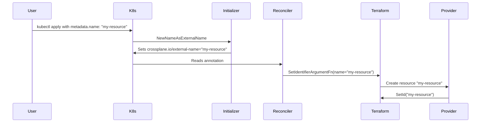

# External name patterns

Every upjet resource needs an external name config. The Terraform ID format
from the import section determines which pattern to use. To confirm the
pattern, check the TF provider source's `d.SetId()` call — it tells you
exactly what format the ID takes at runtime.

## The four patterns

### 1. IdentifierFromProvider — provider generates the ID

The provider assigns the ID (ARN, URL, UUID, random hash). The user's chosen
name is just a parameter in `spec.forProvider`, not the identifier.

**Config:** `config.IdentifierFromProvider`

**Runtime:** The external name is the provider-generated ID. `DisableNameInitializer: true` — `metadata.name` is just the K8s resource name.

**AWS examples:** `aws_sqs_queue`, `aws_vpc`, `aws_db_instance`, `aws_lb`, `aws_cloudfront_distribution`, `aws_acm_certificate` (hundreds of resources)

```yaml
kind: Queue
metadata:
  name: example          # just the K8s resource name
spec:
  forProvider:
    name: upbound-sqs    # the queue name (not the ID)
```

**How to verify:** The Terraform import section shows a URL, ARN, or UUID.
The provider source calls `d.SetId()` with a compound string (e.g. a URL).

---

### 2. NameAsIdentifier — user name IS the ID

The user chooses the name and it IS the identifier. No extra layer (ARN,
URL, UUID) from the provider.

**Config:** `config.NameAsIdentifier`

**Runtime:** `name` is omitted from `spec.forProvider` (in `OmittedFields`).
The `NewNameAsExternalName` initializer copies `metadata.name` to the
`crossplane.io/external-name` annotation. The framework reads the annotation
and passes it to `SetIdentifierArgumentFn`, which sets `name = externalName`
in the Terraform config.



**AWS examples:** `aws_elasticache_serverless_cache`, `aws_opensearchserverless_access_policy`, `aws_opensearchserverless_lifecycle_policy`, `aws_opensearchserverless_security_policy`, `aws_codeguruprofiler_profiling_group`

```yaml
kind: ServerlessCache
metadata:
  name: example-cache    # THIS is the cache name (no spec.forProvider.name)
spec:
  forProvider:
    engine: memcached
```

**⚠️ Warnings:**

- **Don't change `crossplane.io/external-name` on an existing resource.** The
  annotation is the identity key in Terraform state. Changing it tells upjet
  to abandon the old resource and adopt a new name that doesn't exist yet,
  causing an import failure loop that trips the Crossplane circuit breaker.
  Set it at creation (or let the initializer set it) and never touch it again.

- **Generated examples may be empty.** Upjet only uses
  `MetaResource.Examples[0]` from the scraped metadata. If the Terraform
  doc's first example is minimal (only sets `name`), the generated example
  will show `forProvider: {}` for `NameAsIdentifier` resources because
  `name` is in `OmittedFields`. The example is technically correct — the
  name comes from `metadata.name` — but it's not a helpful starting point.
  Stage a richer example manually.

**How to verify:** The Terraform import section shows a bare name. The
provider source calls `d.SetId()` with a bare name (no ARN, no URL, no
quoting).

---

### 3. ParameterAsIdentifier — a spec field IS the ID

A specific field in `spec.forProvider` doubles as the identifier. The field
stays visible in the spec and is NOT omitted.

**Config:** `config.ParameterAsIdentifier("field_name")`

**Runtime:** `DisableNameInitializer: true`. The external name is the value
of the specified field. The field remains in `spec.forProvider` and can be
changed to recreate the resource.

**AWS examples:** `aws_s3_bucket` (field `bucket`), `aws_lambda_function`
(field `function_name`), `aws_redshift_cluster` (field `cluster_identifier`),
`aws_transcribe_vocabulary` (field `vocabulary_name`)

```yaml
kind: Bucket
metadata:
  name: example          # just the K8s resource name
spec:
  forProvider:
    bucket: my-bucket    # THIS is the bucket name and the identifier
    region: us-west-1
```

**How to verify:** The Terraform import section shows a bare field value.
The provider source calls `d.SetId()` with the value of that specific field.

---

### 4. TemplatedStringAsIdentifier / FormattedIdentifierFromProvider — compound IDs

The external name is built from multiple fields using a template with a
separator.

**Config:** `config.TemplatedStringAsIdentifier("name", "template")` or
`FormattedIdentifierFromProvider("separator", "field1", "field2", ...)`

**Runtime:** The template is evaluated at import time. `{{ .external_name }}`
is the Crossplane external-name annotation value. `{{ .parameters.<field> }}`
reads from `spec.forProvider`. `{{ .setup.client_metadata.account_id }}`
reads from provider metadata.

**AWS examples:** `aws_accessanalyzer_archive_rule` (template
`analyzer_name/rule_name`), `aws_s3_bucket_metric` (separator `:`,
fields `bucket` and `name`), `aws_rds_cluster_role_association` (separator `,`,
fields `db_cluster_identifier` and `role_arn`)

```go
config.TemplatedStringAsIdentifier(
    "rule_name",
    "{{ .parameters.analyzer_name }}/{{ .external_name }}",
)
```

Available template variables:

- `{{ .parameters.<field> }}` — any Terraform argument
- `{{ .external_name }}` — the Crossplane external-name annotation value
- `{{ .terraformProviderConfig.<field> }}` — provider config values
- `{{ .setup.client_metadata.account_id }}` — provider client metadata

**How to verify:** The Terraform import section shows a compound format
(e.g. `field1|field2`, `field1/field2`, `field1:field2`). Check the provider
source for `ParseResourceIdentifier` or equivalent splitting logic.

---

## How to decide which pattern to use

| Import format | Pattern |
|---|---|
| `terraform import <r> '<name>'` | `NameAsIdentifier` or `ParameterAsIdentifier` |
| `terraform import <r> <name>` (bare, no quotes) | `NameAsIdentifier` |
| `terraform import <r> <arn>` or `<url>` | `IdentifierFromProvider` |
| `terraform import <r> '<a>\|<b>'` | `TemplatedStringAsIdentifier` or `FormattedIdentifierFromProvider` |
| No import section | `IdentifierFromProvider` (provider-generated ID) |

Then verify by reading the TF provider source: find `d.SetId()` in the
Create function — whatever it receives is the external name format.

## Framework resources

For Terraform Plugin Framework resources, upjet v2 offers additional patterns:

- `config.FrameworkResourceWithComputedIdentifier(field, defaultStub)` — for
  resources whose identifier is computed by the provider, with a stub for
  testing
- `config.FrameworkResourceWithIdentifier(field)` — for resources with a
  user-settable identifier field
